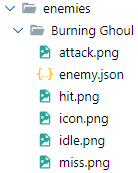

[TOC]


# Documentation

Here you'll find instructions and examples to create each and every type of content that JRPG Builder allows you to create.

## What is this and what can I do with it?

JRPG Builder is framework that allows you to create traditional JRPG experiences without the need to write a single line of code. You only need text files describing what you want to create and the images you want to use.

## Basic setup

When you download JRPG Builder you'll notice that there is an executable file with the name `JRPG Builder` and folder with the name ``campaigns``. This folder is where the different campaigns that you create/download must be located. If it's anywhere else the game won't be able to find it. When explaining where should files go, paths will be given relative to the campaigns folder, for example: `campaigns/your_campaign/items/your_item.json`

### External tools

In order to write text files you can use any text editor, as long as you can save the file as plain text (such as notepad). It's recommended to download and use any IDE that supports linting for `.json` files like [Visual Studio Code](https://code.visualstudio.com/), as it will give you warnings and errors if you make any mistakes in your syntax while writing.

To create art you may use your preferred software as long as you can export to ``.png``, the same restrictions apply to art you download.

### Testing your content

When you create content you can test it by placing in it's place on the campaign folder and launching the game, if there's an error the game will warn you on the console. You can see logs and errors by launching the game from the console on ``Linux`` and ``Mac OS`` or using debug version on ``Windows``.

To launch the game from the console you must navigate to the folder that contains the game and launch the game with the following command:

```shell
./JRPG_Builder
```

## Content creation

### Animation data

`animation_data` is a field that can be optionally found on some content, this is to give you the opportunity to use animations. `animation_data` can be found on enemies, characters and map details.  If you use animation data you also must use a corresponding image with multiple frames, for example:


All frames in the image must be consecutive.

``animation_data`` has the following structure:

```json
"animation_data":
{
    "hframes": int,
    "vframes": int,
    "total_frames": int,
    "duration": float
}
```

*   `hframes` field must be bigger than $0$.
*   `vframes` field must be bigger than $0$.
*   `total_frames` field must be bigger than $0$.
*   `duration` field must bigger than $0$, it represents duration in seconds.

If we use the image above as an example, we'd have the following:

```
"animation_data":
{
    "hframes": 6,
    "vframes": 1,
    "total_frames": 6,
    "duration": 1.5
}
```

We use `"hframes": 6` and `"vframes": 1` because we have $6$ columns and $1$ row, we use `"total_frames": 6` because that's the total of frames in the images (we might, for example, have $6$ columns and $2$ rows, but only $10$ frames). Finally we use `"duration": 1.5` because it's a nice speed, this field's only restriction is that it must be bigger than $0$.

### Items

There exists two types of items: ``equipment `` and ``consumable``. The only difference between ``equipment `` and ``consumable`` is the text you'll write inside `item.json`. Both types can be held in an inventory and be used in a [treasure action](#treasure).

To create an item you must:

1.  Create a folder with the name of your item inside the items folder so that it looks like this: `campaigns/{your_campaign}/items/{your_item}/`.
2.  Create an `item.json` file inside the item's folder.
3.  Create/copy the art you want to use with the name `item.png`. This will be the icon that will be displayed in menus.

The result should look something like this: 

 

#### Equipment

Equipment items can be equipped by characters to modify their attributes, for example equipping a sword to do more damage in combat.

The equipment's `item.json` has the following structure:

```json
{
    "type": "equipment",
    "data":
    {
        "slot": "valid slot",
        "stats":
        {
            "critic": float,
            "speed": int,
            "health": int,
            "strain": int,
            "evasion": float,
            "damage": int
        },
        "min_level": int,
        "rarity": int,
        "description": "This is an item description."
    }
}
```

*   `critic` field must be between $0.0$ and $1.0$.
*   `evasion` field must be between $0.0$ and $1.0.$
*   `slots` field must have one of the following words: `legs`, `torso`, `accessory` or `weapon`.
*   `description` field supports [BBCode](#bbcode) syntax.

#### Consumable

Consumable items are items that increase or decrease a character's attribute upon consumption, for example consuming a health kit to gain health.

The consumable's `item.json` has the following structure:

```json
{
    "type": "consumable",
    "data":
    {
        "effect":
        {
            "type": "valid type",
            "value": int
        },
        "description": "This is an item description."
    }
}
```

*   ``type`` field must have one of the following words: `health`, `damage`, `evasion` or `strain`.
*   ``value`` field uses positive values to increase the amount of the ``type`` attribute.
*   `description` field supports [BBCode](#bbcode) syntax.

### Abilities

Abilities are the actions that a character can execute during their turn in combat. although they can vary a lot they all follow the same structure.

To create an ability you must:

1.  Create a folder with the name of your ability inside the abilities folder so that it looks like this: `campaigns/{your_campaign}/abilities/{your_ability}/`.
2.  Create an `ability.json` file inside the item's folder.
3.  Create/copy the art you want to use with the name `icon.png`. This will be the icon that will be displayed in menus.

The result should look something like this: 

 

`ability.json` has the following structure:

```json
{
    "min_level": int,
    "side": "valid side",
    "cost": int,
    "type": "health",
    "amount": float,
    "description": "This is an ability description."
}
```

*   `min_level` field must be positive. If a character has the ability and it's current level in less than `min_level`, it won't be able to use it in combat.
*   `side` field must have one of the following words: `same` for allies or `opposite` for enemies
*   `cost` field must be positive.
*   ``type`` field must have one of the following words: `health`, `damage`, `evasion` or `strain`.
*   ``amount`` field uses negative values to increase the amount of the ``type`` attribute.

### Enemies

Enemies help define combat, a combat is composed of $1$ to $3$ enemies you'll have to fight. Additionally, every enemy has a list of abilities like the ones described above.

To create an enemy you must:

1.  Create a folder with the enemy's name inside the enemies folder so that it looks like this: `campaigns/{your_campaign}/characters/enemies/{your_enemy}/`.
2.  Create an ``enemy.json``  file inside the enemy's folder.
3.  Create/copy the art you want to use inside the folder with the following name/function:
    *   `icon.png` to show the enemy in the menus.
    *   `attack.png` to display when the enemy is attacking.
    *   `hit.png` to display when the enemy is hit during combat.
    *   `idle.png` to display while the enemy is waiting.
    *   `miss.png` to display when the enemy is attacked, but the attack misses.

>   If you don't want to create different art for all these states, you can simply copy, paste and rename whatever you want to use for all states, we recommend a neutral pose for all states if you choose to do so.

The result should look something like this:

 

``enemy.json`` has the following structures:

```json
{
    "stats":
    {
        "critic": float,
        "speed": int,
        "health": int,
        "strain": int,
        "evasion": float,
        "damage": int
    },
    "abilities":
    [
        "valid_ability_1",
        "valid_ability_2"
    ],
    "animation_data":
    {
        "hframes": int,
        "vframes": int,
        "total_frames": int,
        "duration": float
    },
    "xp_reward": int,
    "scale": float
}
```

*   All fields inside `stats` must be bigger than $0$.
*   `critic` field must be between $0.0$ and $1.0$.
*   `evasion` field must be between $0.0$ and $1.0$.
*   `abilities` field must contain valid ability names and can't be repeated.
*   `xp_reward` must be bigger than $0$.
*   `scale` must be bigger than $0$. It represents the size it has to be displayed to relative to it's original size
*   `animation_data` field is an optional field, which means you don't need to use it if it doesn't suit you. Find more information [here](#animation data).

### Characters

Characters are the protagonist of the story they will be the ones experiencing the story, moving through the map, fighting enemies, etc. They have abilities like enemies, but also have equipment, using items.

To create character you must:

1.  Create a folder with the character's name inside the party folder so that it looks like this: `campaigns/{your_campaign}/characters/party/{your_character}/`.
2.  Create an ``character.json``  file inside the character's folder.
3.  Create/copy the art you want to use inside the folder with the following name/function:
    *   `icon.png` to show the character in the menus.
    *   `attack.png` to display when the character is attacking.
    *   `hit.png` to display when the character is hit during combat.
    *   `idle.png` to display while the character is waiting.
    *   `miss.png` to display when the character is attacked, but the attack misses.

>   If you don't want to create different art for all these states, you can simply copy, paste and rename whatever you want to use for all states, we recommend a neutral pose for all states if you choose to do so.

The result should look something like this:

 

The structure of `character.json` is as follows:

```json
{
    "start_xp": int,
    "min_stats":
    {
        "critic": float,
        "speed": int,
        "health": int,
        "strain": int,
        "evasion": float,
        "damage": int
    },
    "max_stats":
    {
        "critic": float,
        "speed": int,
        "health": int,
        "strain": int,
        "evasion": float,
        "damage": int
    },
    "abilities":
    [
        "valid_ability_1",
        "valid_ability_2"
    ],
    "equipment":
    {
        "legs": "valid_equipment",
        "torso": "valid_equipment",
        "accessory_1": "valid_equipment",
        "accessory_2": "valid_equipment",
        "accessory_3": "valid_equipment",
        "weapon": "valid_equipment"
    },
    "animation_data":
    {
        "hframes": int,
        "vframes": int,
        "total_frames": int,
        "duration": float
    },
    "scale": float
}
```

*   `start_xp` must be bigger than $0$.
*   All fields inside `min_stats` and `max_stats` must be bigger than $0$. It's also recommended that ``max_stats`` be bigger than `min_stats`.
*   `critic` field must be between $0.0$ and $1.0$.
*   `evasion` field must be between $0.0$ and $1.0$.
*   `abilities` field must contain valid ability names and can't be repeated.
*   All fields inside `equipment` must contain the name of an item that is valid and has a slot corresponding to the field it's being assigned to. For example, if we have an item with slot `accessory`, it can be assigned to either `accessory_1`, `accessory_2` or `accessory_3`, but not to `legs`, `torso` and `weapon`. Unlike abilities, equipment can be repeated if the slot allows it. Equipment serves to modify the final stats of the character.
*   `scale` must be bigger than $0$.
*   `animation_data` field is an optional field, which means you don't need to use it if it doesn't suit you. Find more information [here](#animation data).

#### About experience points and levels

Experience points are a measure used to calculate the current level of a character, they are earned through combat, you'll earn the amount in the `xp_reward`  field of every enemy you defeat. A character will level up every $100$ points of experience, with a maximum level of 30.
$$
CurrentLevel = Min(floor(\frac{CurrentExperience}{100}), 30)
$$
The raw stats of a character are calculated interpolating linearly between `min_stats` and `max_stats`. So a character with level $1$ will have stats equal to `min_stats` and and a character of level $30$ will have stats equal to `max_stats`.

A character's level also limits the what items it can equip and what abilities it can use.

>   It is recommended that characters have at least one ability to use with their initial level, otherwise they won't be able to do anything in combat.

### Dialogues

Dialogues simulate a conversation with one or more characters, they are one of the 2 elements used to convey direct storytelling, alongside cutscenes.

To create a conversation you must:

1.  Create a `{your_dialogue}.json` file inside the dialogue's folder, ``campaigns/{your_campaign}/dialogues/``.

2.  Create a `portraits/` folder and create/copy the art you want to use inside it. Their name is irrelevant, but they must use the `.png` extension. This folder holds the portraits that will be shown during the dialogue.

    >   You can copy the icons used for characters and enemies, as it generally gives consistency to the story.

The result should look something like this:

  

The structure of `dialogue.json` is as follows:

```json
{
    "dialogue":
    [
        {
            "character": "valid_portrait_name",
            "side": "valid_side",
            "text": "example_text"
        },
        {
            "character": "valid_portrait_name",
            "side": "valid_side",
            "text": "example_text"
        },
        {
            "character": "valid_portrait_name",
            "side": "valid_side",
            "text": "example_text"
        }
    ]
}
```

*   `dialogue` field contains a list of individual dialogue nodes, the amount of dialogue nodes must  be bigger than $0$, it has no upper limit.
*   `character` field must be the valid name of a portrait.
*   `side` field must be either `r` (right) or `l` (left), indicating the side on which the portrait will appear.
*   `text` field contains the text that will be displayed as dialogue, it supports [BBCode](#bbcode) syntax.

### Cutscenes

Cutscenes display a series of images and text in a manner similar to a slide-show, they are one of the 2 elements used to convey direct storytelling, alongside dialogues.

To create a cutscene you must:

1.  Create a folder with the cutscene name inside the cutscenes folder so that it looks like this: `campaigns/{your_campaign}/cutscenes/{your_cutscene}`.
2.  Create a `cutscene.json` file inside the cutscene's folder.
3.  Create an `images/` folder and create/copy the art you want to use inside it. Their name is irrelevant, but they must use the `.png` extension.

The result should look something like this:

 

 The structure of `cutscene.json` is as follows:

```json
{
    "cutscene":
    [
        {
            "text" : "example_text",
            "image" : "valid_image_name"
        },
        {
            "text" : "example_text",
            "image" : "valid_image_name"
        },
        {
            "text" : "example_text",
            "image" : "valid_image_name"
        }
    ]
}
```

*   `cutscene` field contains a list of individual cutscene nodes, the amount of cutscene nodes must  be bigger than $0$, it has no upper limit.
*   `text` field contains the text that will be displayed in the cutscene, it supports [BBCode](#bbcode) syntax.
*   `image` field must be a valid name of a cutscene image.

### Maps

Maps are the most important and complex content, they contain the information to move in the game and they call for the use of other content

To create a map you must:

1.  Create a folder with the map's name inside the maps folder so that it looks like this: `campaigns/{your_campaign}/maps/{your_map}/`.

2.  Create an ``map.json``  file inside the map's folder.

3.  Create two folders, `detail_art/` and `map_nodes/` inside the map folder you just created.

4.  Create/copy the art you want to use as map nodes inside `map_nodes/`, there should be:

    *   `node_between.png`, this is used to indicate the path between two navigation nodes.
    *   `node_path.png`, this is used to indicate a navigation node that is only connected to $2$ other nodes.
    *   `node_intersection.png`, this is used to indicate a navigation node that is not connected to $2$ other nodes.

    >   If there's no desire to visually have different types of nodes, you can simply use you preferred node art and copy, paste and rename whatever you want to use for all other nodes.

5.  Create/copy the art you want to use as map details inside the `map_details/` folder, you can use whatever name you want, but the art must use the `.png` extension.

6.  Create/copy the map you want to use inside the map folder with the name `map.png`, also create/copy the background you wish to use as `combat_background.png`, and finally create/copy the art you want to use as an avatar with the name `player_avatar.png`.

The result should look something like this:

 

Due to the complexity of the `map.json` file, we'll explain it by parts. In it's most basic form, it looks like:

```json
{
    "navigation_nodes":
    [
    	//Here go the navigation nodes
    ],
    "detail_art":
    [
        //Here goes the detail art
    ],
    "background_info":
    {
        "x_offset": float,
        "y_offset": float,
        "color" :
        {
            "r": int,
            "g": int,
            "b": int
        },
        "scale": float
    },
    "avatar_scale": float
}
```

*   fields inside `color` must be between $0$ and $255$.
*   `scale` field must be bigger than $0$.
*   `avatar_scale` field must be bigger than $0$.

#### Navigation nodes

Navigation nodes define the data needed to have navigation and interactions in the map. They have the following structure:

```json
{
    "x": int,
    "y": int,
    "connected_nodes":[int],
    "actions": [
        // Here go actions
    ]
}
```

*   `connected_nodes` field contains a list of the indexes of the nodes the current one is connected to. Both nodes must be present inside each others `connected_nodes`, in order to successfully connect.
*   `actions` contains a list of the [actions](#actions) that are to be performed when reaching a node.

#### Detail art

Detail art allows more visual customization of the map. It has the following structure:

```json
{
    "x": int,
    "y": int,
    "scale": float,
    "rotation": int,
    "filepath": "valid path",
    "animation_data":
    {
        "hframes": int,
        "vframes": int,
        "total_frames": int,
        "duration": float
    }
}
```

*   `scale` field must be bigger than $0$.
*   `rotation` field can either $0$ (camera parallel) or $1$ (camera perpendicular)
*   `filepath` field contains the path to the desired detail art, relative to the `detail_art/` folder.
*   `animation_data` field is an optional field, which means you don't need to use it if it doesn't suit you. Find more information [here](#animation data).

#### Actions

Actions are smaller bits of content that can be triggered inside a map, the map in and of itself can't do anything except allow navigation through it, with actions we can actually create a game with encounters, dialogues, cut-scenes, etc.

Actions can queued one after the other to launch a sequence of actions, this helps create more complex forms of actions by combining simpler ones.

##### Travel

The travel action allows the player to travel between different maps, its structure is as  follows:

```json
{
    "type" : "travel",
    "data" :
    {
        "map_name" : "valid_map",
        "access_point" : int
    }
}
```

*   `id` field must contain the name of a valid map
*   `access_point` field must be bigger than $0$, this represents the index of the navigation node where the player will appear upon loading the map.

##### Treasure

The treasure action serves to give items to the party, be it as a reward or anything else. It's structure is as follows:

```json
{
    "type" : "treasure",
    "data" :
    {
        "items":
        [
            "valid_item_1",
            "valid_item_2",
            "valid_item_3"
        ]
    }
}
```

*   `items` must contain a list of names of valid items. It must contain at least one item

##### Combat

The combat action launches a combat scenario, it follows the following structure:

```json
{
    "type" : "combat",
    "data" :
    {
        "enemies" :
        [
            "valid_enemy_1",
            "valid_enemy_2",
            "valid_enemy_3"
        ]
    }
}
```

*   `enemies` must contain a list of valid enemy names. It must contain between $1$ and $3$ enemies, included.

##### Dialogue

Dialogue actions simply trigger a given dialogue, their structure is as  follows:

```json
{
    "type" : "dialogue",
    "data" :
    {
        "id": "valid_dialogue"
    }
}
```

*   `id` must contain the name of a valid dialogue.

##### Cutscene

Cutscene actions simply trigger a given cutscene, their structure is as  follows:

```json
{
    "type" : "cutscene",
    "data" :
    {
        "id": "valid_cutscene"
    }
}
```

*   `id` must contain the name of a valid cutscene.

##### Wait

Wait actions add a pause before being consumed, this is useful to moderate pace, it's structure is a s follows:

```json
{
    "type" : "wait",
    "data" :
    {
        "amount" : float
    }
}
```

*   `amount` field must be bigger than $0$, it represent the amount of time in seconds.

## Campaigns

Campaign files are files that simply describe the starting conditions of the campaign.

To create a campaign you must:

1.  Create a folder with your campaign name inside the campaigns folder so that it looks like: `campaigns/{your_campaign}/`.
2.  Create a `campaign.json` file inside said folder.
3.  Create/copy  all desired content inside said folder (maps, characters, dialogues, items, ...).

The result should look something like this:

 

 The structure of `campaign.json` is as follows:

```json
{
    "map_name": "valid_map_name",
    "access_point": int,
    "party":
    [
        "valid_character_name_1",
        "valid_character_name_2",
        "valid_character_name_3"
    ],
    "inventory":
    [
        "valid_item_name_1",
        "valid_item_name_2",
        "valid_item_name_3"
    ],
    "description": "text_example"
}
```

*   `map_name` field must be the name of a valid map.
*   `access_point` field must be bigger than $0$, this represents the index of the navigation node where the player will appear upon loading the map.
*   `party` field contains a list of $1$ to $3$ valid characters name that form the original party.
*   `inventory` field contains a list  of valid item names.
*   `description` field supports [BBCode](#bbcode) syntax.

### BBCode

BBCode syntax allows you to easily add effects on your text, ranging from basic ones like bolds or italics, to animated effects like shake.

| Command           | Tag                                                | Description                                                  |
| ----------------- | -------------------------------------------------- | :----------------------------------------------------------- |
| **bold**          | `[b]{text}[/b]`                                    | Makes {text} bold.                                           |
| **italics**       | `[i]{text}[/i]`                                    | Makes {text} italics.                                        |
| **underline**     | `[u]{text}[/u]`                                    | Makes {text} underline.                                      |
| **strikethrough** | `[s]{text}[/s]`                                    | Makes {text} strikethrough.                                  |
| **code**          | `[code]{text}[/code]`                              | Makes {text} monospace.                                      |
| **center**        | `[center]{text}[/center]`                          | Makes {text} centered.                                       |
| **right**         | `[right]{text}[/right]`                            | Makes {text} right-aligned.                                  |
| **fill**          | `[fill]{text}[/fill]`                              | Makes {text} fill width.                                     |
| **indent**        | `[indent]{text}[/indent]`                          | Increase indent level of {text}.                             |
| **url**           | `[url]{url}[/url]`                                 | Show {url} as such.                                          |
| **url (ref)**     | `[url=]{text}[/url]`                               | Makes {text} reference <url>.                                |
| **image**         | `[img]{path}[/img]`                                | Insert image at resource {path}.                             |
| **resized image** | `[img=]{path}[/img]`                               | Insert image at resource {path} using <width> (keeps ratio). |
| **resized image** | `[img=x]{path}[/img]`                              | Insert image at resource {path} using <width> & <height>.    |
| **font**          | `[font=]{text}[/font]`                             | Use custom font at <path> for {text}.                        |
| **color**         | `[color=]{text}[/color]`                           | Change {text} color; use name or # format, such as #ff00ff.  |
| **Wave**          | `[wave amp=50 freq=2]{text}[/wave]`                | Wave makes the text go up and down.                          |
| **Tornado**       | `[tornado radius=5 freq=2]{text}[/tornado]`        | Tornado makes the text move around in a circle.              |
| **Shake**         | `[shake rate=5 level=10]{text}[/shake]`            | Shake makes the text shake.                                  |
| **Fade**          | `[fade start=4 length=14]{text}[/fade]`            | Fade creates a fade effect over the text that is not animated. |
| **Rainbow**       | `[rainbow freq=0.2 sat=10 val=20]{text}[/rainbow]` | Rainbow gives the text a rainbow color that changes over time. |

